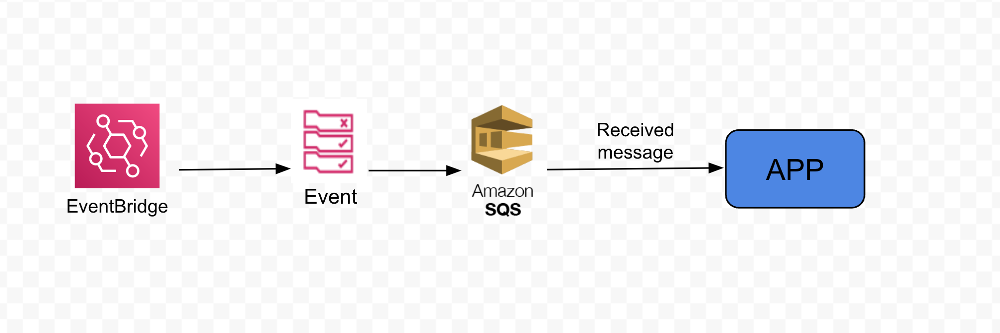
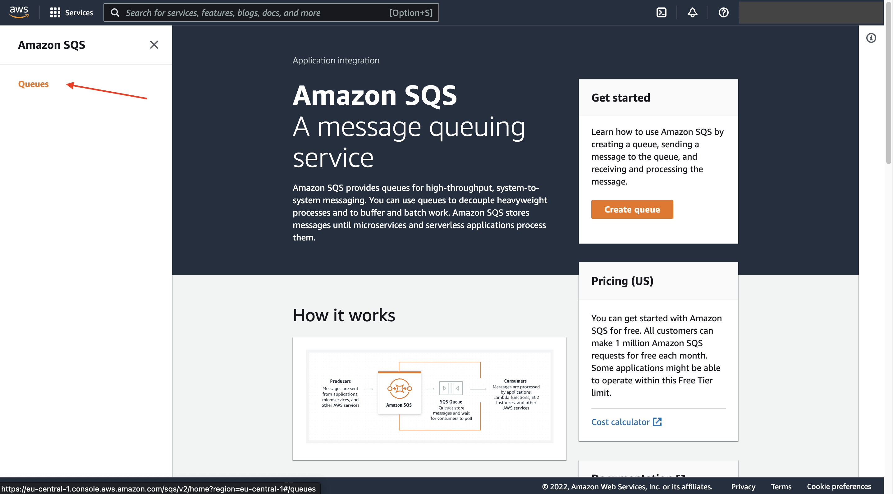
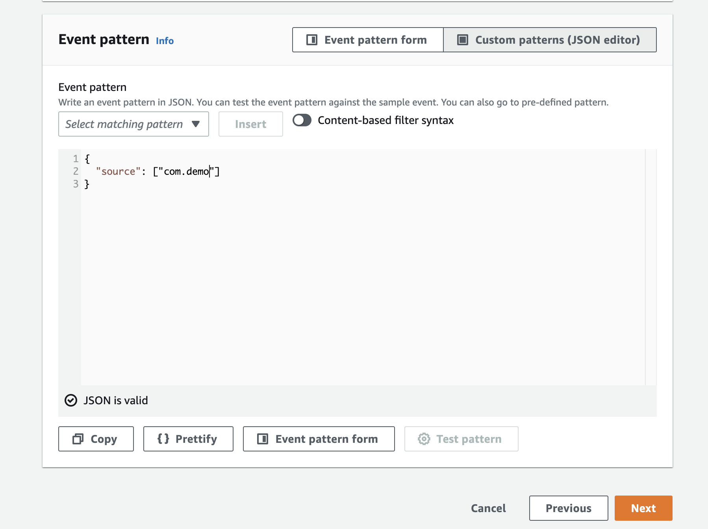
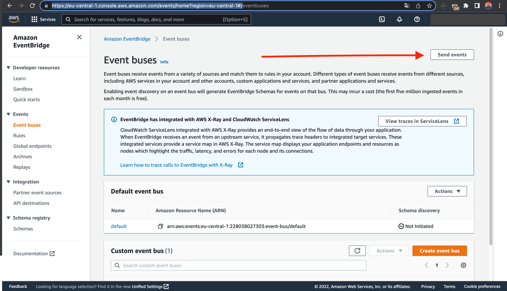
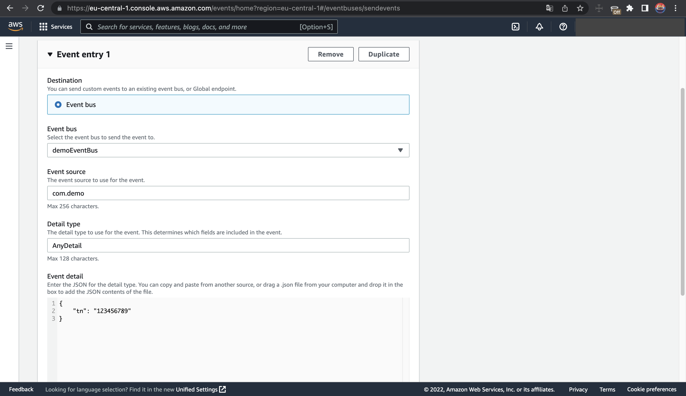
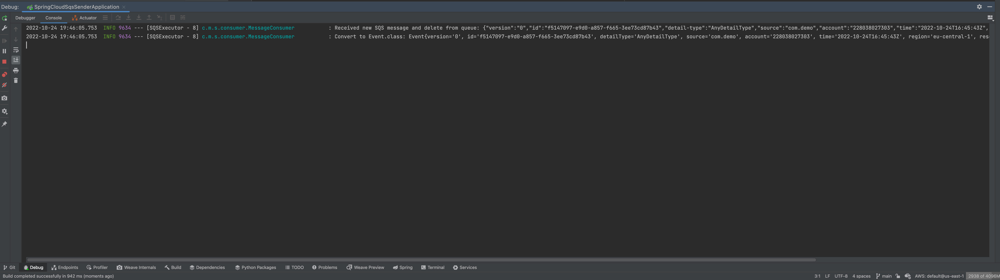

# Spring cloud sqs listener

[EventBridge](https://aws.amazon.com/eventbridge/)
[Amazon SQS](https://aws.amazon.com/sqs/)



### Step 1: Implementation of consumer messages from a queue.

* Need to add sdk dependency:
```xml
<dependency>
  <groupId>org.springframework.cloud</groupId>
  <artifactId>spring-cloud-aws-messaging</artifactId>
</dependency>

<dependencyManagement>
<dependencies>
  <dependency>
    <groupId>org.springframework.cloud</groupId>
    <artifactId>spring-cloud-dependencies</artifactId>
    <version>Hoxton.SR12</version>
    <type>pom</type>
    <scope>import</scope>
  </dependency>
</dependencies>
</dependencyManagement>
```
* Then we need to implement this code snippet to received messages from Amazon SQS:
```java
@Component
@Slf4j
public class MessageConsumer {

    private static final ObjectMapper OBJECT_MAPPER = Jackson2ObjectMapperBuilder.json().build();

    @SqsListener(value = "${orders.queue.name}", deletionPolicy = SqsMessageDeletionPolicy.ON_SUCCESS)
    public void processMessage(String message) {
        try {
            Event event = OBJECT_MAPPER.readValue(message, Event.class);
            log.info("Received new SQS message and delete from queue: {}", message);
            log.info("Convert to Event.class: {}", event);
        } catch (Exception e) {
            throw new RuntimeException("Cannot process message from SQS", e);
        }
    }

}

```

* [Configure your aws credentials](https://docs.aws.amazon.com/sdk-for-java/v1/developer-guide/setup-credentials.html)

### Step 2: Configure Amazon SQS

[Go to - AmazonSQS](https://eu-central-1.console.aws.amazon.com/sqs/v2/home?region=eu-central-1#/homepage)

#### Create queue
* Click widget in right side and click Queues 
* Click on button **Create queue**
* Choose name of queue
* Everything we can keep by default for demo
* Down below click on button **Create queue**

### Step 3: Configure EventBridge

[Go to - EventBridge](https://eu-central-1.console.aws.amazon.com/events/home?region=eu-central-1#/)

#### Create custom event bus
* Click on navigation panel under **Events** -> Event buses.
* Click on button **Create event bus**
* Choose name of event bus
* Create

#### Create custom rule
* Click on navigation panel under **Events** -> Rules.
* Click on button **Create rule**
* Choose the event bus that you previously created
* Click Next
* Choose under Event source **AWS events or EventBridge partner events**
* Add event pattern

* Click Next
* Target 1 - select AWS Service
* Select target type **SQS queue**
* * Select your created queue
* Click on button next
* Create rule

### Step 4: Publish event to EventBridge using amazon test environment.
[Go to - EventBridge](https://eu-central-1.console.aws.amazon.com/events/home?region=eu-central-1#/eventbuses)
* Click on button **Send events**


* Select your event bus from the list
* Specify source that we created in event pattern **com.demo**
* Specify any detail type(*required field)
* Specify payload that will be in event details

* Click on button **Send**

### Step 5: Start spring application and GET request

* Run application
* Expected logs will be that we are receiving message from sqs:

